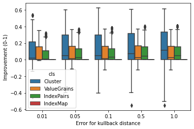
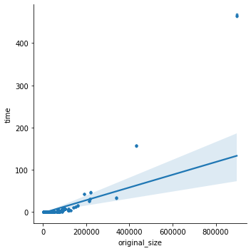
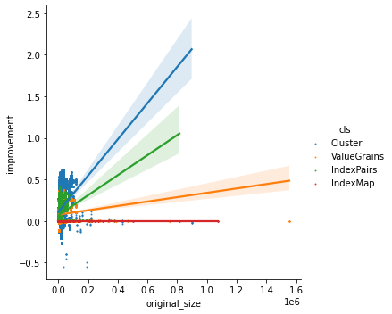
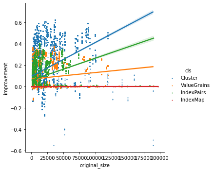

```python
import os

import pandas as pd
import seaborn as sns

from experiments import medical_cluster_reduction as md
```


```python
dir_path = "resultados/resultados_26_03"
files = [os.path.join(dir_path, f) 
         for f in os.listdir(dir_path) if f.endswith('.json')]
stats = md.Statistics.from_files(*files)
```


```python
data = stats.dataframe(); data
```

    ['original_size', 'reduced_size', 'cls', 'cpd', 'error', 'time', 'net', 'var', 'improvement']


<div>
<style scoped>
    .dataframe tbody tr th:only-of-type {
        vertical-align: middle;
    }

    .dataframe tbody tr th {
        vertical-align: top;
    }

    .dataframe thead th {
        text-align: right;
    }
</style>
<table border="1" class="dataframe">
  <thead>
    <tr style="text-align: right;">
      <th></th>
      <th>original_size</th>
      <th>reduced_size</th>
      <th>cls</th>
      <th>cpd</th>
      <th>error</th>
      <th>time</th>
      <th>net</th>
      <th>var</th>
      <th>improvement</th>
    </tr>
  </thead>
  <tbody>
    <tr>
      <th>0</th>
      <td>1453</td>
      <td>1453</td>
      <td>Cluster</td>
      <td>CPD in ANAPHYLAXIS conditional on []</td>
      <td>0.01</td>
      <td>0.000178</td>
      <td>0</td>
      <td>0</td>
      <td>0.0</td>
    </tr>
    <tr>
      <th>1</th>
      <td>1499</td>
      <td>1499</td>
      <td>ValueGrains</td>
      <td>CPD in ANAPHYLAXIS conditional on []</td>
      <td>0.01</td>
      <td>0.000178</td>
      <td>0</td>
      <td>0</td>
      <td>0.0</td>
    </tr>
    <tr>
      <th>2</th>
      <td>1174</td>
      <td>1174</td>
      <td>IndexPairs</td>
      <td>CPD in ANAPHYLAXIS conditional on []</td>
      <td>0.01</td>
      <td>0.000178</td>
      <td>0</td>
      <td>0</td>
      <td>0.0</td>
    </tr>
    <tr>
      <th>3</th>
      <td>1043</td>
      <td>1043</td>
      <td>IndexMap</td>
      <td>CPD in ANAPHYLAXIS conditional on []</td>
      <td>0.01</td>
      <td>0.000178</td>
      <td>0</td>
      <td>0</td>
      <td>0.0</td>
    </tr>
    <tr>
      <th>4</th>
      <td>1453</td>
      <td>1453</td>
      <td>Cluster</td>
      <td>CPD in ANAPHYLAXIS conditional on []</td>
      <td>0.05</td>
      <td>0.000134</td>
      <td>0</td>
      <td>0</td>
      <td>0.0</td>
    </tr>
    <tr>
      <th>...</th>
      <td>...</td>
      <td>...</td>
      <td>...</td>
      <td>...</td>
      <td>...</td>
      <td>...</td>
      <td>...</td>
      <td>...</td>
      <td>...</td>
    </tr>
    <tr>
      <th>155995</th>
      <td>4207</td>
      <td>4207</td>
      <td>IndexMap</td>
      <td>CPD in R_LNLT1_LP_APB_MUDENS conditional on ['...</td>
      <td>0.50</td>
      <td>0.000793</td>
      <td>0</td>
      <td>0</td>
      <td>0.0</td>
    </tr>
    <tr>
      <th>155996</th>
      <td>3897</td>
      <td>3897</td>
      <td>Cluster</td>
      <td>CPD in R_LNLT1_LP_APB_MUDENS conditional on ['...</td>
      <td>1.00</td>
      <td>0.000794</td>
      <td>0</td>
      <td>0</td>
      <td>0.0</td>
    </tr>
    <tr>
      <th>155997</th>
      <td>5919</td>
      <td>5919</td>
      <td>ValueGrains</td>
      <td>CPD in R_LNLT1_LP_APB_MUDENS conditional on ['...</td>
      <td>1.00</td>
      <td>0.000794</td>
      <td>0</td>
      <td>0</td>
      <td>0.0</td>
    </tr>
    <tr>
      <th>155998</th>
      <td>3538</td>
      <td>3538</td>
      <td>IndexPairs</td>
      <td>CPD in R_LNLT1_LP_APB_MUDENS conditional on ['...</td>
      <td>1.00</td>
      <td>0.000794</td>
      <td>0</td>
      <td>0</td>
      <td>0.0</td>
    </tr>
    <tr>
      <th>155999</th>
      <td>4207</td>
      <td>4207</td>
      <td>IndexMap</td>
      <td>CPD in R_LNLT1_LP_APB_MUDENS conditional on ['...</td>
      <td>1.00</td>
      <td>0.000794</td>
      <td>0</td>
      <td>0</td>
      <td>0.0</td>
    </tr>
  </tbody>
</table>
<p>156000 rows × 9 columns</p>
</div>


```python
boxplot = sns.boxplot(x="error", y="improvement", hue="cls", data=data)
boxplot = boxplot.set(xlabel="Error for kullback distance", ylabel="Improvement (0-1)")
```


    

    


```python
aux = data[data.cls == 'Cluster'] # time is the same for every class, thus we avoid repetitions
```


```python
lmplot = sns.lmplot(x="original_size", y="time", data=aux, scatter_kws={"s": 8})
```


    

    


```python
lmplot = sns.lmplot(x="original_size", y="improvement", hue='cls', 
                    data=data, scatter_kws={"s": 1})
```


    

    


```python
outlierless_size_data = data[data.original_size < 0.2*10**6]
lmplot = sns.lmplot(x="original_size", y="improvement", hue='cls', 
                    data=outlierless_size_data, scatter_kws={"s": 1})
```


    

    


```python

```
